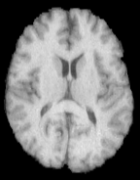
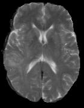

# Memory-efficient GAN
PyTorch implementation of [Multi-scale GANs for Memory-efficient Generation of High Resolution Medical Images](https://arxiv.org/abs/1907.01376).
There are a few differences to the original paper. For exmple we use open source brain MRI images here. Also the reception field on every lower-resolution scale is made larger than the reception field of every high-resolution scale, which perfoms better. 

|  |  |  |
| :--: | :--: | :--: |
| *Real LPBA* | *Real T2* | *Real T1* |  

## Prerequisites 
- Linux or MacOS
- Python 3
- PyTorch>0.4
- NVIDIA GPU + CUDA CuDNN
- MATLAB (Optional, but you will need to write a new edge extraction function)

## Getting started
### Instalation
- Clone this repo
- Install the requirements

### Datasets
Here we establish image translation between the [LPBA40](https://resource.loni.usc.edu/resources/atlases-downloads/) dataset and [BRATS](http://braintumorsegmentation.org/) challenge image data. You need to download both datasets before you start. 
- Training: We use the BRATS T2 HGG and LGG data for training and train to translate image edges to gray value images.
- Testing: For testing we extract the edges from all 40 LPBA images. We use the native-space skull-stripped LPBA images and transform them to delineation space. 


### Folder structure
This code works with following directory structure. You can choose another structure, however think about replacing the default options of the root directories. 
```
.
├── Data
│   ├── SKETCH2BRATST23D
│   │   ├── A
│   │   │   ├── test
│   │   │   │   ├── data_list.txt
│   │   │   └── train
│   │   │       ├── data_list.txt
│   │   │       └── data_list_valid.txt
│   │   └── B
│   │       ├── test
│   │       │   ├── data_list.txt
│   │       └── train
│   │           ├── data_list.txt
│   │           └── data_list_valid.txt
│   ├── BRATST2_3D #preprocessed BRATS and sketches
│   └── LPBA3D #preprocessed LPBA and sketches
│
├── Results
│   ├── SKETCH2BRATST23D 
│   │   └── LPBATest #test predicted images
│   ├── SKETCH2BRATST23D_HR1 #high resolution scale 1, chekpoints
│   │   └── Val #validation images
│   ├── SKETCH2BRATST23D_HR2
│   │   └── Val
│   ├── SKETCH2BRATST23D_HR3
│   │   └── Val
│   └── SKETCH2BRATST23D_LR #low resolution scale 0, chekpoints
│       └── Val
│       
└── Code
    └── MEGAN
         ├── README.md
         ├── requirements.txt
         ├── ...
```

## Usage

### Preprocessing
If  you wish to use the same datasets as ours, you can use our preprocessing scripts. 
```sh
$ python MEGAN/preprpcess_BRATS3D.py --in_img_dir path/to/BRATS/images
$ python MEGAN/preprpcess_LPBA3D.py --in_img_dir path/to/LPBA/images
```

### Training
To train each level:
```sh
$ python MEGAN/train_BRATS3D_LR.py 
$ python MEGAN/train_BRATS3D_HR.py --LR_size 32 --HR_size 64 --level_name HR1
$ python MEGAN/train_BRATS3D_HR.py --LR_size 64 --HR_size 128 --level_name HR2
$ python MEGAN/train_BRATS3D_HR.py --LR_size 128 --HR_size 256 --level_name HR1 
```
Don't forget to set batch sizes using the argument ```batch_size```.  

### Testing
To get high resolution images when the GANs are trained simply run: 
```sh
$ python MEGAN/test_BRATS3D.py
```
```
@conference {MEGAN,
	title = {Multi-scale GANs for Memory-efficient Generation of High Resolution Medical Images},
	booktitle = {22nd International Conference on  Medical Image Computing and Computer Assisted Intervention, MICCAI 2019},
	year = {In Press},
	address = {Shenzen, China},
	author = {Uzunova, Hristina and Jan Ehrhardt and Jacob, Fabian and Frydrychowicz, Alex and Heinz Handels}
}
```
